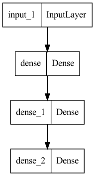
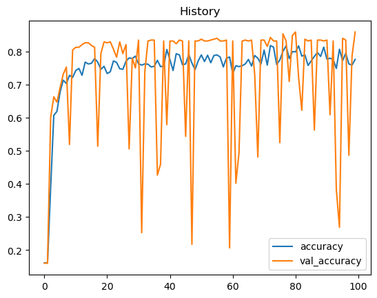
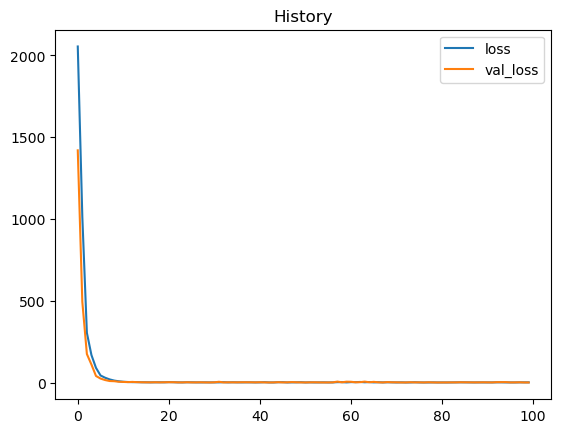

# HR_Attrition
Used a Deep Neural Network to determine which employees are high risk

## Overview

Using employee data, a deep neural network was trained to predict whether an employee was high risk for leaving the company. The model performed with 86% test accuracy. The architecture for the model is show below. Two Hidden layers were used, with a Dense layer as the output layer. 

## Results

The training shows much noise in the plot below. This could be refined by adding additional data and training until the curve plateaus. This noise is likely due to the nature of the data as well as the simplicity of the model. 

The loss shows less noise, with no evidence of overfitting.

## Summary

This model is somewhat reliable in identifying high risk employees. However, a more complex architecture will be needed to make the training and validation stages more reliable.
